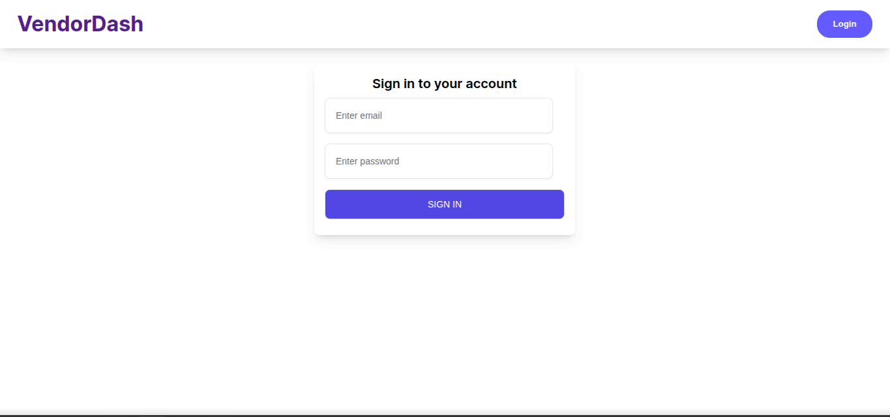
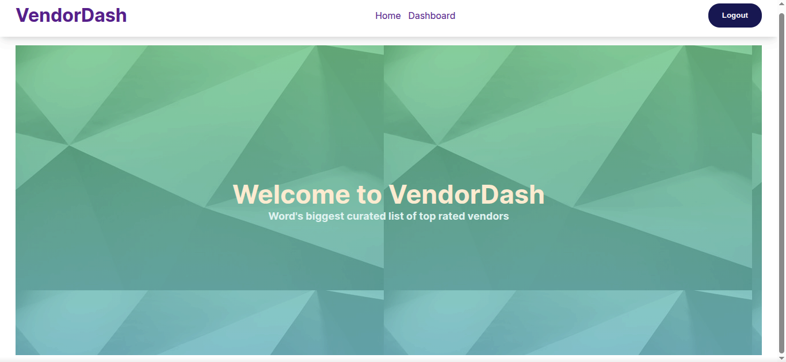
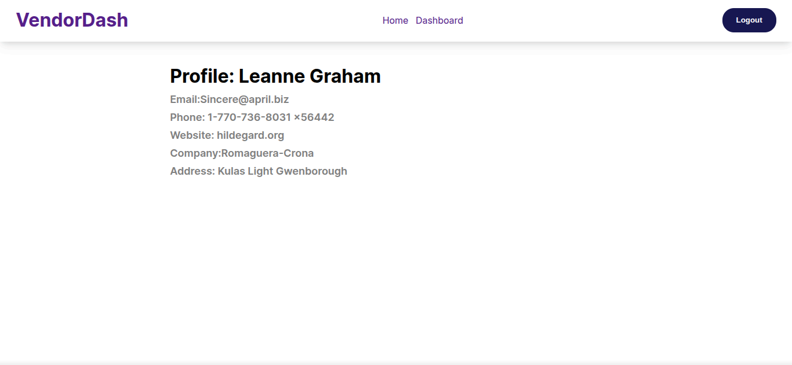

# Vendor Dashboard Application

## 📌 Project Objective

A React-based web application built as a practical assessment to demonstrate proficiency in fundamental React concepts, state management, API integration, and routing. The application allows a user to log in using a mocked authentication system, view a fetched list of vendors, search through them, and view individual vendor details.

## 🚀 Features

- **Mock Authentication:** A secure-feeling login page that validates specific mock credentials before granting access to the dashboard.
- **Vendor Dashboard:** Fetches and displays a list of vendors from a public API (`jsonplaceholder.typicode.com/users`), showing their Name, Email, Phone, and Company.
- **Live Search Filtering:** Includes a search bar that instantly filters the displayed list of vendors by name using array `.filter()`.
- **Dynamic Vendor Details:** Clicking on a specific vendor navigates to a dynamic route displaying deeper information (Website, Address, etc.).
- **Logout Functionality:** Safely clears the user's authentication state and redirects them back to the login screen.
- **UX Enhancements (Bonus):** Implements loading states while fetching data and graceful error handling for failed API calls.

## 🛠️ Tech Stack & Concepts Demonstrated

- **Frontend Framework:** React (Functional Components)
- **Routing:** React Router DOM (`/login`, `/dashboard`, `/vendor/:id`)
- **State Management:** React Hooks (`useState`, `useEffect`)
- **API Integration:** Axios / Fetch API with Promises (`async/await`)
- **Data Manipulation:** Array `.map()` and `.filter()`

## 🔐 Mock Login Credentials

To test the application, please use the following credentials on the `/login` page:

- **Email:** `admin@test.com`
- **Password:** `123456`

_(Entering any other credentials will result in an "Invalid login credentials" error message)._

## 🚦 Getting Started

Follow these instructions to get a local copy up and running on your machine.

### Prerequisites

- Node.js installed on your local machine.

### Installation & Execution

1. **Clone the repository and install dependencies:**

   ```bash
   git clone [https://github.com/Clinton-odia/VendorDashboardApp.git](https://github.com/Clinton-odia/VendorDashboardApp.git)
   cd VendorDashboardApp
   npm install
   npm run dev

   ## 📸 Screenshots
   ```

- **Login Page:** 

- **Dashboard & Search:** 

- **Vendor Details:** 
